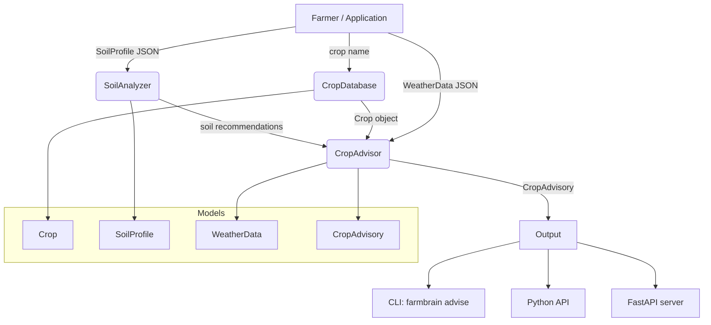

# aumai-farmbrain

> Crop advisory and soil analysis engine for Indian agriculture — part of the [AumAI](https://github.com/aumai) open-source agentic infrastructure suite.

[](https://pypi.org/project/aumai-farmbrain/)
[](https://www.python.org/downloads/)
[](LICENSE)
[](https://github.com/aumai/aumai-farmbrain/actions)

---

> **AGRICULTURAL DISCLAIMER**
> This tool provides AI-assisted agricultural analysis only. Verify all recommendations with
> local agricultural experts and government extension services before application. Crop yields
> and soil recommendations are estimates based on limited data. Always consult your nearest
> Krishi Vigyan Kendra (KVK) or state agriculture department before making agronomic decisions.

---

## What is FarmBrain?

Imagine you are a farmer in Vidarbha with three hectares of black cotton soil. You have a soil
test result in hand and want to know: which crop should I plant this kharif season, how much
fertilizer do I apply at each stage, and should I be worried about the heat forecast?

Before FarmBrain, answering those questions required visiting a Krishi Vigyan Kendra, waiting
weeks for advisory bulletins, or paying for a consultant. FarmBrain encodes that knowledge
into open, programmable Python — a library any developer, agrotech startup, or digital
agriculture platform can embed.

FarmBrain is not a magic oracle. It is a rule-based advisory engine grounded in ICAR (Indian
Council of Agricultural Research) guidelines and a catalogue of 50+ Indian crops. Think of it
as a well-trained junior agronomist that never sleeps, speaks Python, and can be integrated
into any application in minutes.

## Why Does This Matter?

Indian agriculture feeds 1.4 billion people, yet most farmers still lack timely, personalised
guidance on the single most consequential set of decisions they make each year: what to plant,
how much input to apply, and when to irrigate. The cost of that guidance gap is measured in
wasted fertilizer, failed crops, and avoidable debt.

FarmBrain's first-principles design addresses this by:

1. **Making domain knowledge queryable.** A 50+ crop database covering kharif, rabi, and zaid
   seasons, cross-referenced with soil types, water requirements, and growth durations.
2. **Making soil test data actionable.** ICAR nutrient thresholds for N, P, K, pH, and organic
   carbon are applied deterministically, producing plain-language recommendations any farmer
   can act on.
3. **Integrating weather context.** Crop advisories are adjusted for temperature extremes,
   excess rainfall, and high humidity to surface risk alerts before problems occur.
4. **Being embeddable.** FarmBrain is a pure Python library with a CLI and optional FastAPI
   server — it fits into mobile apps, SMS gateways, WhatsApp bots, and enterprise dashboards.

## Architecture



**Data flow in a single advisory request:**
1. `CropDatabase` looks up the requested crop by name.
2. `SoilAnalyzer` evaluates N, P, K, pH, and organic carbon against ICAR thresholds.
3. `CropAdvisor` combines the crop object, soil analysis, and optional weather observations.
4. A `CropAdvisory` Pydantic model is returned containing recommendations, a stage-wise
   fertilizer plan, an irrigation schedule, and any risk alerts.

## Features

- **50+ Indian crops** catalogued across kharif, rabi, and zaid seasons
- **Soil analysis engine** based on ICAR nutrient guidelines (pH, N, P, K, organic carbon)
- **Stage-wise fertilizer plans** for rice, wheat, cotton, and a generic fallback
- **Irrigation scheduling** by water-requirement class (high / medium / low)
- **Weather risk alerts** for heatwave (>40°C), cold stress, excess rainfall (>200 mm), and
  high humidity (>85%)
- **Crop compatibility lookup** by soil type and pH
- **CLI** with `advise`, `crops`, and `serve` subcommands
- **Pydantic v2 models** with full validation — safe to use at API boundaries
- **Typed, strict Python 3.11+** — zero `Any`, full mypy compliance
- **Apache 2.0 licensed** — use freely in commercial products

## Quick Start

### Install

```bash
pip install aumai-farmbrain
```

Or with `uv`:

```bash
uv add aumai-farmbrain
```

### Python API — three lines to an advisory

```python
from aumai_farmbrain.core import CropDatabase, CropAdvisor
from aumai_farmbrain.models import SoilProfile

db = CropDatabase()
crop = db.by_name("wheat")

soil = SoilProfile(
    ph=7.2,
    nitrogen_ppm=180.0,
    phosphorus_ppm=15.0,
    potassium_ppm=200.0,
    organic_carbon_pct=0.6,
    soil_type="alluvial",
)

advisory = CropAdvisor().advise(crop, soil)

for rec in advisory.recommendations:
    print(rec)

for stage, instruction in advisory.fertilizer_plan.items():
    print(f"[{stage}] {instruction}")
```

### CLI — generate an advisory from JSON files

Create a soil profile file:

```bash
cat > soil.json << 'EOF'
{
  "ph": 6.8,
  "nitrogen_ppm": 120.0,
  "phosphorus_ppm": 8.0,
  "potassium_ppm": 95.0,
  "organic_carbon_pct": 0.42,
  "soil_type": "alluvial"
}
EOF
```

Run the advisory:

```bash
farmbrain advise --crop wheat --soil soil.json
```

Optionally include weather:

```bash
cat > weather.json << 'EOF'
{
  "location": "Lucknow, UP",
  "temperature_c": 42.0,
  "humidity_pct": 55.0,
  "rainfall_mm": 0.0,
  "forecast_days": 7
}
EOF

farmbrain advise --crop wheat --soil soil.json --weather weather.json
```

## CLI Reference

### `farmbrain advise`

Generate a complete crop advisory.

```
Usage: farmbrain advise [OPTIONS]

Options:
  --crop TEXT        Crop name, e.g. rice, wheat, cotton  [required]
  --soil PATH        Path to JSON file with SoilProfile data  [required]
  --weather PATH     Optional path to JSON file with WeatherData
  --help             Show this message and exit.
```

**Example output:**

```
============================================================
CROP ADVISORY: WHEAT
============================================================

RECOMMENDATIONS:
  - Wheat is a rabi crop requiring medium water and 120 days to mature.
  - Compatible soil types: alluvial, loam, clay loam. Current soil type is alluvial.
  - Soil pH 6.8 is within the optimal range (6.0-7.5).
  - Nitrogen is LOW. Apply urea (46% N) at 120-150 kg/ha or incorporate green manure.
  - Phosphorus is LOW. Apply DAP (18-46-0) at 100-125 kg/ha or SSP.
  - Potassium is LOW. Apply MOP at 60-80 kg/ha.
  - Organic carbon 0.42% is below 0.50%. Incorporate FYM 10-15 tonnes/ha.

FERTILIZER PLAN:
  [BASAL] Apply DAP 50 kg/ha + MOP 20 kg/ha at sowing.
  [CROWN ROOT INITIATION] Top-dress urea 60 kg/ha at CRI stage (20-25 DAS).
  [JOINTING] Apply urea 30 kg/ha at jointing stage.

IRRIGATION SCHEDULE:
  [ESTABLISHMENT] Apply light irrigation at sowing.
  [VEGETATIVE] Irrigate every 10-12 days or at 50% soil moisture depletion.
  [REPRODUCTIVE] Irrigate every 7-10 days at flowering/grain fill.
  [MATURATION] Reduce irrigation 2-3 weeks before harvest.
```

---

### `farmbrain crops`

List available crops, optionally filtered by season.

```
Usage: farmbrain crops [OPTIONS]

Options:
  --list            List all available crops
  --season TEXT     Filter by season: kharif, rabi, zaid
  --help            Show this message and exit.
```

**Examples:**

```bash
# List all crops
farmbrain crops --list

# List only kharif crops
farmbrain crops --season kharif

# List rabi crops
farmbrain crops --season rabi
```

---

### `farmbrain serve`

Start the FarmBrain FastAPI server (requires `uvicorn`).

```
Usage: farmbrain serve [OPTIONS]

Options:
  --port INTEGER    Port to serve on  [default: 8000]
  --host TEXT       Host to bind to  [default: 127.0.0.1]
  --help            Show this message and exit.
```

```bash
# Start server
farmbrain serve

# Bind to all interfaces on port 9000
farmbrain serve --host 0.0.0.0 --port 9000
```

Requires `uvicorn`: `pip install uvicorn`.

---

## Python API Examples

### Look up crops by season

```python
from aumai_farmbrain.core import CropDatabase

db = CropDatabase()

kharif = db.by_season("kharif")
print(f"Kharif crops: {len(kharif)}")

rabi = db.by_season("rabi")
print(f"Rabi crops: {len(rabi)}")

zaid = db.by_season("zaid")
print(f"Zaid crops: {len(zaid)}")
```

### Find crops compatible with a soil type

```python
from aumai_farmbrain.core import CropDatabase

db = CropDatabase()
black_soil_crops = db.by_soil_type("black")
for crop in black_soil_crops:
    print(f"{crop.name} ({crop.season}) — {crop.growth_days} days")
```

### Analyse a soil profile

```python
from aumai_farmbrain.core import SoilAnalyzer
from aumai_farmbrain.models import SoilProfile

analyzer = SoilAnalyzer()
soil = SoilProfile(
    ph=5.2,
    nitrogen_ppm=90.0,
    phosphorus_ppm=7.0,
    potassium_ppm=85.0,
    organic_carbon_pct=0.3,
    soil_type="red",
)

recommendations = analyzer.analyze(soil)
for rec in recommendations:
    print(rec)

# Find crops that will grow in this acidic red soil
compatible = analyzer.suitable_crops(soil)
print(f"\n{len(compatible)} compatible crops found:")
for c in compatible:
    print(f"  {c.name}")
```

### Advisory with weather integration

```python
from aumai_farmbrain.core import CropAdvisor, CropDatabase
from aumai_farmbrain.models import SoilProfile, WeatherData

db = CropDatabase()
advisor = CropAdvisor()

crop = db.by_name("rice")
soil = SoilProfile(
    ph=6.2,
    nitrogen_ppm=130.0,
    phosphorus_ppm=12.0,
    potassium_ppm=150.0,
    organic_carbon_pct=0.7,
    soil_type="alluvial",
)
weather = WeatherData(
    location="Patna, Bihar",
    temperature_c=38.0,
    humidity_pct=88.0,
    rainfall_mm=250.0,
    forecast_days=7,
)

advisory = advisor.advise(crop, soil, weather)

# Structured output — serialise to JSON for an API response
import json
print(json.dumps(advisory.model_dump(), indent=2, default=str))
```

### Serialising advisories to JSON

All models are Pydantic v2 `BaseModel` subclasses:

```python
advisory_json = advisory.model_dump_json(indent=2)
advisory_dict = advisory.model_dump()

# Reconstruct from dict
from aumai_farmbrain.models import CropAdvisory
restored = CropAdvisory.model_validate(advisory_dict)
```

## Configuration

FarmBrain has no external runtime dependencies beyond its Python packages. No configuration
file is required.

The `CropDatabase` and `SoilAnalyzer` classes accept optional constructor arguments for
dependency injection:

```python
from aumai_farmbrain.core import CropDatabase, SoilAnalyzer

custom_db = CropDatabase()  # or a subclass with your own crops
analyzer = SoilAnalyzer(crop_db=custom_db)
```

ICAR threshold constants are module-level in `core.py` (prefixed with `_`). Override them for
a specific agro-climatic zone by subclassing `SoilAnalyzer` or patching before instantiation.

## How It Works — Deep Dive

### CropDatabase

The crop catalogue is a static list of 50+ Python dicts compiled from ICAR variety
documentation. At import time, each dict is validated into a `Crop` Pydantic model.
Lookups are O(n) linear scans — fast enough for the current dataset size.

```
_RAW_CROPS  -->  [Crop(**entry) for entry in _RAW_CROPS]  -->  self._crops
```

### SoilAnalyzer

The analyzer compares each of the five soil parameters against ICAR-derived thresholds:

| Parameter        | Low threshold | High threshold |
|------------------|---------------|----------------|
| pH               | < 6.0         | > 7.5          |
| Nitrogen (ppm)   | < 140         | > 280          |
| Phosphorus (ppm) | < 10          | > 25           |
| Potassium (ppm)  | < 108         | > 280          |
| Organic carbon % | < 0.50        | —              |

Each out-of-range value triggers a plain-English recommendation with a specific corrective
action (lime, gypsum, urea, DAP, MOP, or farmyard manure).

`suitable_crops()` applies a pH heuristic on top of soil-type matching: crops that prefer
acidic conditions (rice, jute, turmeric, ginger) are allowed below pH 5.5; most crops are
allowed in the 5.5–8.0 range; drought-tolerant low-water-requirement crops are allowed above
pH 8.0.

### CropAdvisor

`CropAdvisor.advise()` is the main entry point. It:

1. Generates base recommendations from the crop metadata.
2. Calls `SoilAnalyzer.analyze()` and appends its output.
3. Applies weather risk rules if a `WeatherData` object is provided.
4. Selects a fertilizer plan by crop name (rice, wheat, cotton, or default).
5. Selects an irrigation schedule by water requirement class.
6. Returns a validated `CropAdvisory` model.

## Integration with Other AumAI Projects

| Project              | Integration point |
|----------------------|-------------------|
| **aumai-kisanmitra** | KisanMitra's farmer assistant routes fertilizer and irrigation queries to FarmBrain's `CropAdvisor`. |
| **aumai-climatewatch** | Weather alerts from ClimateWatch map to `WeatherData` objects for risk alert enrichment. |
| **aumai-specs**      | Defines inter-project contract schemas that FarmBrain models implement. |

Example bridge — feeding a ClimateWatch observation into FarmBrain:

```python
from aumai_farmbrain.models import WeatherData

# report is a aumai_climatewatch.models.ClimateReport
weather = WeatherData(
    location=report.zone.name,
    temperature_c=float(report.current_conditions["temperature_c"]),
    humidity_pct=float(report.current_conditions["humidity_pct"]),
    rainfall_mm=float(report.current_conditions["rainfall_mm"]),
    forecast_days=7,
)
advisory = CropAdvisor().advise(crop, soil, weather)
```

## Contributing

We welcome contributions. Please read [CONTRIBUTING.md](CONTRIBUTING.md) and
[AGENTS.md](AGENTS.md) before opening a pull request.

Quick checklist:
- Run `make lint` (ruff + mypy) before pushing.
- Run `make test` and ensure all tests pass.
- New public API must include type hints and a docstring.
- Crop and soil data additions must cite an ICAR or state agriculture department source.

## License

Apache License 2.0. See [LICENSE](LICENSE) for details.

Copyright 2024 AumAI Contributors.
